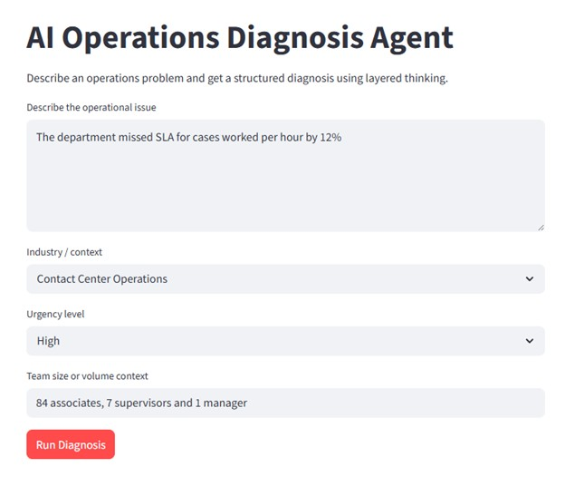
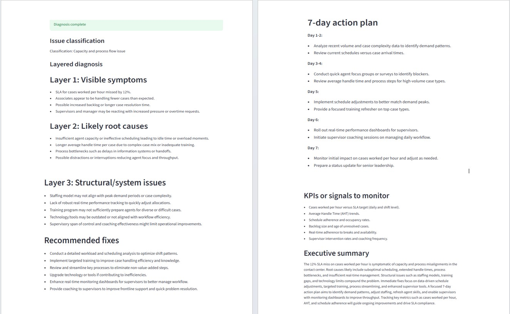

# AI Operations Diagnosis Agent

A browser-based AI agent that helps operations leaders turn messy business problems into structured root-cause analysis.

This project uses **Python**, **Streamlit**, and the **OpenAI Agents SDK** to analyze operational issues through a layered diagnosis framework focused on visibility, root causes, system design, and action planning.

## Live Demo

[Open the AI Operations Diagnosis Agent](https://ai-operations-diagnosis-agent.streamlit.app/)

---

## Project Purpose

Many operational problems do not start as people problems.

They show up as missed SLAs, backlog growth, customer escalations, unclear ownership, repeated handoff failures, poor visibility, or reactive leadership updates.

The purpose of this app is to show how AI can support operations leaders by creating structure around those problems. Instead of giving generic advice, the agent helps translate a messy operational issue into a clear diagnosis that leaders can act on.

This project reflects a practical use of AI in operations, process improvement, project management, and workflow optimization.

---

## App Screenshots

### Input Screen



### Diagnosis Output



---

## What the App Does

The user enters:

- An operational problem statement
- Industry or business context
- Urgency level
- Team size or volume context

The app then runs a two-step AI workflow:

### 1. Issue Classification Tool

A tool/function classifies the operational issue before diagnosis. This gives the agent more structure before producing the final response.

### 2. Operations Diagnosis Agent

An OpenAI Agents SDK workflow generates a structured diagnosis using a Layered Thinking framework.

The final output includes:

- Layer 1: Visible symptoms
- Layer 2: Likely root causes
- Layer 3: Structural/system issues
- Recommended fixes
- 7-day action plan
- KPIs or signals to monitor
- Executive summary

---

## Diagnosis Framework

The app uses a Layered Thinking framework to separate surface-level symptoms from deeper system issues.

### Layer 1: Visible Symptoms

What is showing up on the surface?

Examples include:

- Missed SLAs
- Delayed handoffs
- Backlog growth
- Repeat customer contacts
- Escalations
- Rework
- Inconsistent updates
- Low visibility into work status

### Layer 2: Likely Root Causes

What may be driving the issue?

Examples include:

- Unclear ownership
- Weak handoff rules
- Poor prioritization
- Missing feedback loops
- Inconsistent process execution
- Unclear escalation triggers
- Limited reporting visibility

### Layer 3: Structural/System Issues

What in the operating system allows the issue to continue?

Examples include:

- Undocumented workflows
- Reactive governance
- No standardized case movement rules
- No shared source of truth
- Reporting that shows outcomes but not process friction
- Processes built for a smaller or simpler operation

---

## Example Use Case

A user might enter:

> Our team is missing SLA targets because cases are sitting too long between handoffs. Leaders keep asking for more updates, but the process still feels reactive. Nobody is clear on who owns the next step after the first review.

The agent returns a structured diagnosis that helps identify whether the issue is a people problem, a process problem, a visibility problem, or a system design problem.

---

## Tools and Technologies

- Python
- Streamlit
- OpenAI Agents SDK
- python-dotenv
- GitHub Codespaces
- GitHub
- Streamlit Community Cloud
- Environment-variable-based secret management

---

## Skills Demonstrated

This project demonstrates:

- AI-assisted operations diagnosis
- Agent workflow design
- Tool/function design for issue classification
- Prompt design for structured business outputs
- Workflow optimization thinking
- Root-cause analysis
- Process improvement
- Streamlit web app development
- Secure API key handling with environment variables
- GitHub-based portfolio project development
- Deployment through Streamlit Community Cloud

---

## How to Run Locally

### 1. Clone the repository

```bash
git clone https://github.com/KingAdamas/ai-operations-diagnosis-agent.git
cd ai-operations-diagnosis-agent
```

### 2. Create and activate a virtual environment

```bash
python3 -m venv .venv
source .venv/bin/activate
```

### 3. Install dependencies

```bash
pip install -r requirements.txt
```

### 4. Add your OpenAI API key

Create a `.env` file:

```bash
touch .env
```

Add your key:

```env
OPENAI_API_KEY=your_api_key_here
```

Do not commit your `.env` file.

### 5. Run the app

```bash
streamlit run app.py
```

---

## Deployment

This app is deployed with Streamlit Community Cloud.

The OpenAI API key is stored as a Streamlit secret and is not committed to GitHub.

---

## Security Notes

This project uses environment variables for API key management.

API keys should never be:

- Hard-coded in the app
- Printed in logs
- Exposed in screenshots
- Committed to GitHub
- Shared publicly

Users should also avoid entering confidential, private, or sensitive business information into public demo apps.

---

## Portfolio Positioning

This project was built to demonstrate practical AI application in operations leadership.

Rather than using AI as a generic chatbot, this app shows how an AI agent can support better decision-making by creating structure, visibility, and action steps around real operational problems.

It reflects my broader professional focus:

> Helping organizations fix what slows them down by improving workflows, clarifying ownership, and building better operating systems.

---

## Author

Built by **Derek Blissett** as a portfolio project demonstrating AI, operations strategy, workflow optimization, and practical app development.